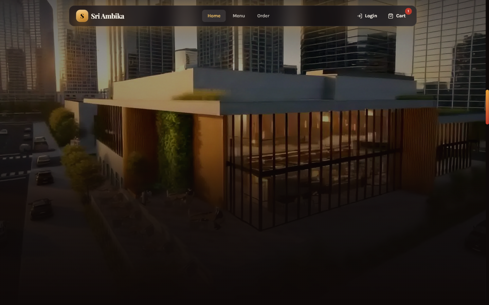
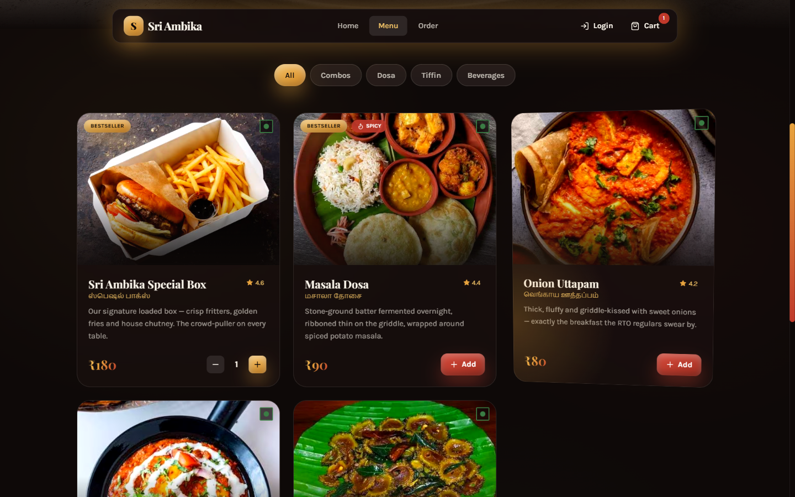
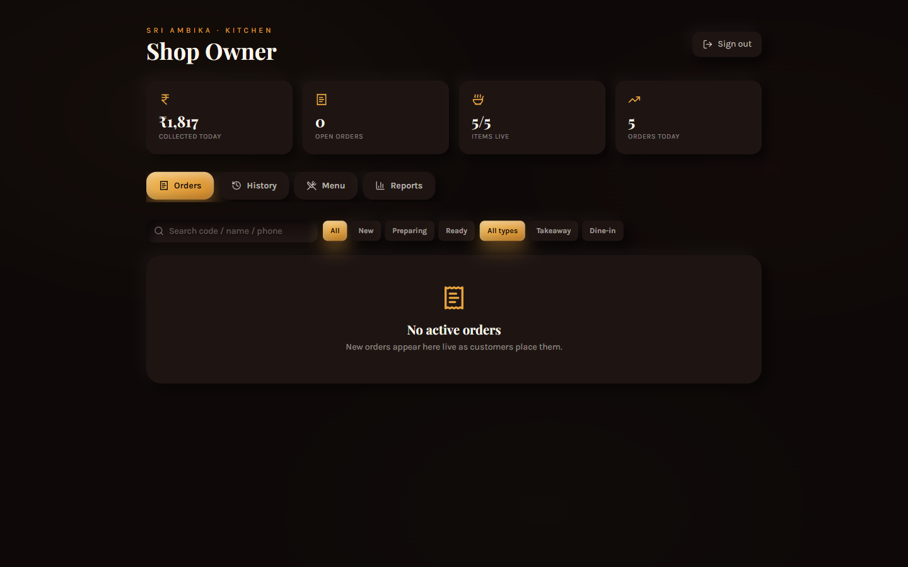
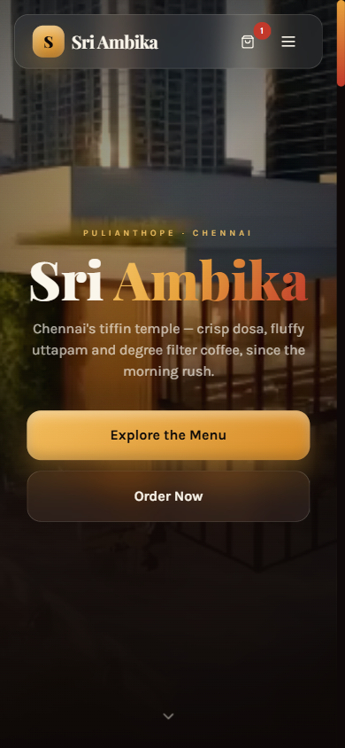
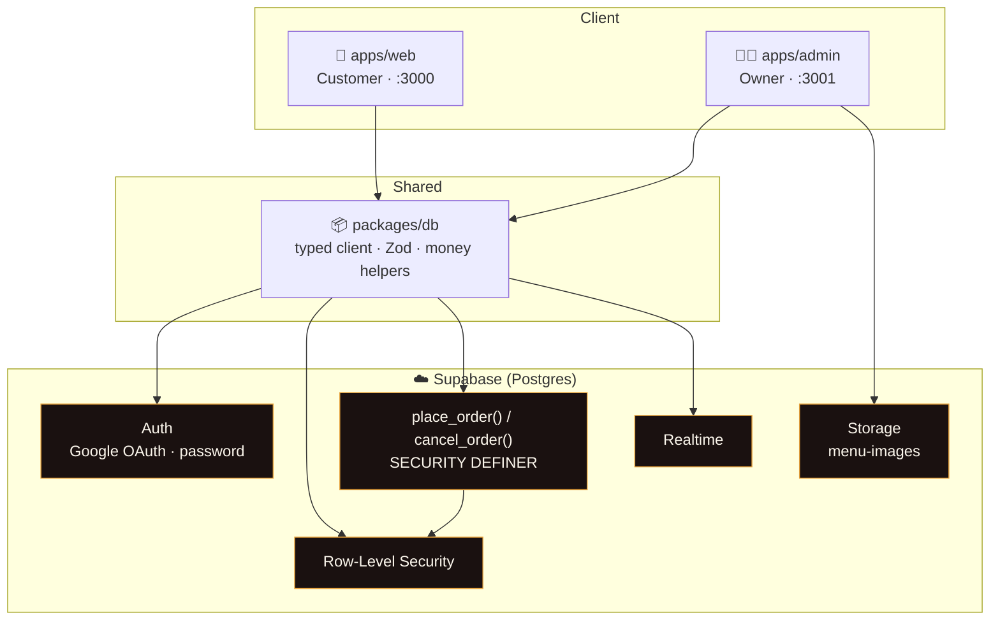
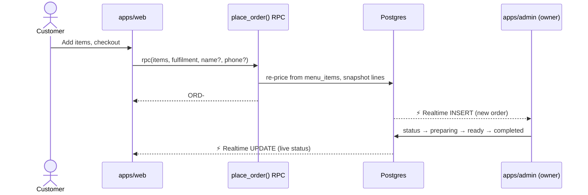
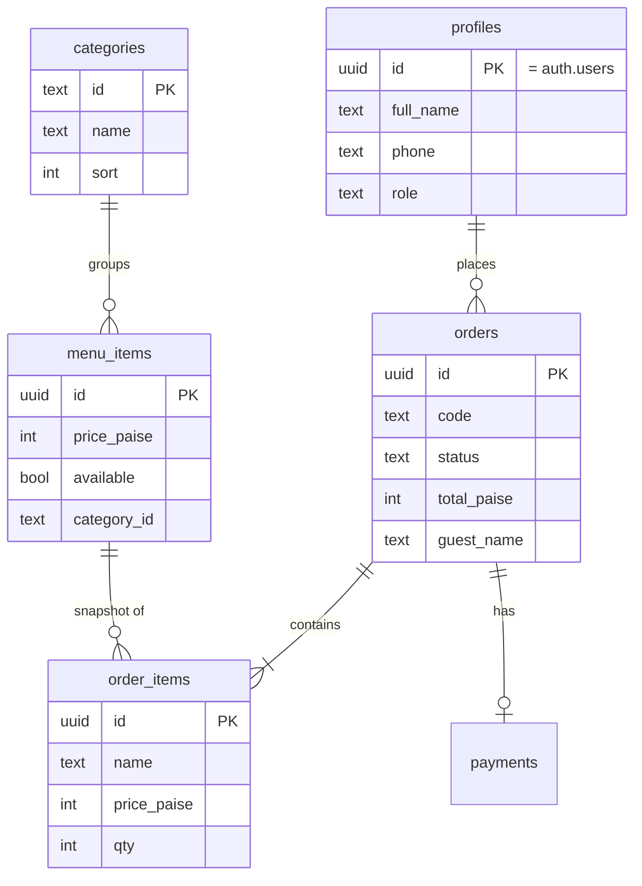

<div align="center">

# 🍛 Sri Ambika

### A cinematic, full-stack ordering platform for a South-Indian tiffin house in Pulianthope, Chennai.

*From a humble corner plot to a digital landmark — crisp dosa, fluffy uttapam and degree filter coffee, ordered in a tap.*

<br/>

[](https://nextjs.org/)
[](https://www.typescriptlang.org/)
[](https://tailwindcss.com/)
[](https://supabase.com/)

[](https://www.framer.com/motion/)
[](https://www.remotion.dev/)
[](https://www.postgresql.org/)


</div>

---

<div align="center">

|  |  |
| :---: | :---: |
|  |  |
| **Cinematic scroll-scrub landing** | **Live, RLS-backed menu** |
|  |  |
| **Owner kitchen console** | **Mobile-first, hero-lite** |

</div>

---

## ✨ Overview

**Sri Ambika** is a real ordering platform built for a small pure-veg tiffin shop. It pairs a **cinematic, editorial customer experience** with a **practical, single-owner kitchen console** — two separately-deployable apps sharing one type-safe database layer.

Two ideas drive the whole build:

1. **The storefront should feel like a flagship.** A 300-frame scroll-scrubbing hero (an empty plot building into a sunlit landmark), glassmorphism, neumorphism, claymorphism, a bento grid, film grain, kinetic type, a marquee of real Google reviews, and a Remotion-rendered brand reel.
2. **The kitchen tools should be dead simple.** Username + password for the owner, live incoming orders, one-tap status flow, menu & category management with photo uploads, and clean PDF sales reports.

---

## 🧭 Features

<table>
<tr>
<td width="50%" valign="top">

### 🙋 Customer app (`apps/web`)
- 🎞️ **Scroll-scrub hero** — 300 frames scrubbed to scroll on desktop; an automatic **lightweight static hero on mobile** (no 40 MB download)
- 🍽️ **Live menu** — categories, availability, Tamil names, bestseller/spicy badges, 3-D tilt + spotlight cards
- 🛒 **Cart & checkout** — guest **or** Google account, GST bill, pickup / dine-in
- 👤 **Google Sign-In** + guest checkout (auto `Guest-#####` identity)
- 📜 **Order history** with **live status** (Supabase Realtime)
- 🔁 **One-tap reorder** & **self-service cancel**
- 📱 Fully responsive, `prefers-reduced-motion` aware

</td>
<td width="50%" valign="top">

### 👨‍🍳 Owner console (`apps/admin`)
- 🔐 **Username + password** login (no email/phone needed)
- ⚡ **Live orders** stream in via Realtime
- 🟢 **Status flow** — New → Preparing → Ready → Completed, + mark paid
- 🗂️ **History** tab — completed & cancelled, read-only, filterable
- 🍲 **Menu management** — availability, inline price, add/remove, **photo upload to Storage**
- 🏷️ **Category management** — create/assign categories on the fly
- 📊 **Reports** — today / month / custom range + **clean branded PDF export**
- 🔎 Search & filters everywhere · mobile-friendly

</td>
</tr>
</table>

---

## 🛠️ Tech Stack

| Layer | Technology |
| --- | --- |
| **Framework** | Next.js 14 (App Router) · React 18 · TypeScript |
| **Styling** | Tailwind CSS · custom design system (glass / neu / clay tokens) |
| **Motion** | Framer Motion · canvas scroll-scrubbing · **Remotion** brand reel |
| **State** | Zustand (cart, local UI) |
| **Backend** | Supabase — PostgreSQL · Auth · Storage · Realtime |
| **Security** | Row-Level Security · `SECURITY DEFINER` RPCs · server-recomputed totals |
| **Tooling** | npm workspaces monorepo · `sharp` (image pipeline) · `pg` (zero-Docker migrations) · `jspdf` (reports) |
| **Design intelligence** | UI/UX Pro Max skill — Playfair Display + Karla, sunset-amber palette |

---

## 🏗️ Architecture



> **Security boundary is the database, not the UI.** Both apps talk to the same Postgres; **RLS policies** decide who can read/write. Orders are created *only* through `place_order()`, which recomputes every price server-side — the client can never tamper with totals.

### 🧾 Order flow



### 🗄️ Data model



> 💰 **Money is stored as integer paise everywhere** — never floats.

---

## 📁 Project structure

```
sri-ambika/
├─ apps/
│  ├─ web/                  # customer site  → :3000  (Google sign-in + guest)
│  │  ├─ app/               #   landing · menu · order · account · login
│  │  └─ src/components/    #   ScrollHero, MobileHero, DishCard, OrderClient…
│  └─ admin/                # owner console  → :3001  (username + password)
│     └─ src/components/    #   Dashboard, Orders/History/Menu/Reports panels
├─ packages/
│  └─ db/                   # shared Supabase client, types, Zod schemas, money
├─ supabase/
│  └─ migrations/           # schema · RLS · place_order · storage · realtime…
├─ scripts/                 # zero-Docker migration runner, owner/admin setup, frame upscaler
├─ images/                  # 300 pristine source hero frames (QHD)
└─ docs/screenshots/        # README imagery
```

---

## 🚀 Getting started

### Prerequisites
- **Node.js 18+**
- A **Supabase** project (free tier is fine — region `ap-south-1` recommended)

### 1 · Install
```bash
npm install
```

### 2 · Configure environment
Public keys go in each app; **secrets stay server-side and are git-ignored.**

```bash
# apps/web/.env.local   &   apps/admin/.env.local  (PUBLIC values)
NEXT_PUBLIC_SUPABASE_URL=https://<project>.supabase.co
NEXT_PUBLIC_SUPABASE_ANON_KEY=<anon / publishable key>

# .env  (root — used ONLY by the migration scripts)
DATABASE_URL=postgresql://postgres:<password>@db.<project>.supabase.co:5432/postgres
```
> 🔴 The `service_role` key and DB password are **secrets** — never commit them, never put them in a `NEXT_PUBLIC_` variable. `.env*` files are git-ignored; `.env.example` templates are provided.

### 3 · Create the database
Zero Docker, zero Supabase CLI — a tiny `pg` runner applies every migration in order:
```bash
npm run db:push     # tables, RLS, functions, storage, seed
npm run db:check    # prints table counts + the seeded menu
```

### 4 · Create the owner account
```bash
npm run set:admin -- owner 'YourStrongPassword' 'Shop Owner'
```

### 5 · Run
```bash
npm run dev:web     # → http://localhost:3000   (customer)
npm run dev:admin   # → http://localhost:3001   (owner console)
```

---

## 📜 Scripts

| Script | What it does |
| --- | --- |
| `npm run dev:web` / `dev:admin` | Run the customer / admin app |
| `npm run build:web` / `build:admin` | Production build |
| `npm run db:push` | Apply SQL migrations to Supabase (no Docker) |
| `npm run db:check` | Sanity-check tables & seed |
| `npm run set:admin -- <user> <pass> [name]` | Create/update the owner login |
| `npm run set:owner -- <email> [role]` | Promote/demote a Google account |
| `npm run upscale:frames` | Re-encode hero frames (`sharp`) |

---

## 🔒 Security highlights

- **Row-Level Security** on every table — public reads the menu, users see only *their* orders, only the owner writes.
- **No price tampering** — `place_order()` is `SECURITY DEFINER` and recomputes subtotal, 5 % GST and total from the database, ignoring any amounts the client sends.
- **Per-app session isolation** — distinct auth cookies (`sb-sriambika-web` / `-admin`) so the two apps never share a session, even on `localhost`.
- **Verified writes** — admin mutations confirm rows actually changed (catching silent RLS rejections).
- **Secrets discipline** — `service_role` only ever lives server-side; the customer bundle ships nothing but the public anon key.

---

## 🎨 Design language

A premium, cinematic system layered from many techniques — **glassmorphism · neumorphism · claymorphism · bento grid · aurora gradients · film grain · duotone imagery · kinetic typography · 3-D tilt & spotlight · magnetic buttons**.

| Token | Value |
| --- | --- |
| Display / Body | Playfair Display · Karla |
| Espresso | `#1A1110` |
| Sunset amber | `#E8A33D` |
| Terracotta | `#C0392B` |
| Banana-leaf | `#3A7D44` |
| Ivory | `#FBF6EC` |

---

## 🗺️ Roadmap

- [x] Cinematic landing + menu + cart/checkout
- [x] Supabase backend, RLS, secure ordering RPC
- [x] Google sign-in + guest checkout · order history · reorder · cancel
- [x] Owner console — live orders, menu/category management, history
- [x] Reports + clean PDF export
- [x] Mobile pass (hero-lite + responsive)
- [ ] 💳 Razorpay / UPI online payments
- [ ] 🔔 Order notifications (WhatsApp / email)
- [ ] 🛡️ OWASP hardening + rate limiting
- [ ] 🚀 Two-host production deploy (custom domains)

---

<div align="center">

**Sri Ambika** · Pulianthope, Chennai · *Tiffin, perfected.*

Crafted with cinematic scroll, glass &amp; grain.

</div>
